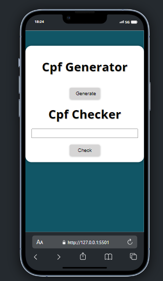

# Gerador / Validador de CPF 
[](https://github.com/GuilhermeHenrii/Cpf_generator/blob/main/LICENSE)
# Sobre o projeto

Nesse projeto / exercício, foi proposto pelo professor Luis Otávio Miranda, a criação de um gerador de CPFs válidos, foi apresentado o algoritmo de validação usado pela justiça federal do Brasil e, dado esse algoritmo o código foi implementado. Com o código do gerador pronto, pude reaproveitar partes da lógica do mesmo para criar um validador de CPF.

Sinta-se a vontade para fazer suas alterações no código.
Obrigador por dedicar seu tempo aqui! Até mais.

## Layout mobile


## Layout web


# Tecnologias utilizadas
- HTML / CSS / JS

# Como executar o projeto
Pré-requisitos: VsCode, node

```bash
# clonar repositório
git clone https://github.com/GuilhermeHenrii/Cpf_generator.git

# entrar na pasta do projeto front end web
cd cpf_generator

# instalar dependências
npm install

# executar o projeto
# Execute o live server na .html raiz
```

# Autor

Guilherme Henrique da Silva Lopes

https://www.linkedin.com/in/guilherme-henrique-7aab6b229/
